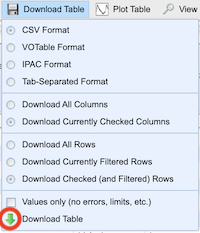

# Quelques idées de sujets

Nous vous proposons ci-dessous des idées de sujets. Vous pouvez choisir de travailler sur un sujet qui n'est pas dans la liste, à condition de nous en parler avant (appelez un enseignant).

Le 1er sujet, sur les pentominos, utilise `numpy` et est un sujet plutôt bien défini.

Les autres sujets, utilisent `pandas`, et sont plus ouverts:

* nous vous signalons quelques jeux de données qui pourraient être intéressants à
explorer, à vous de définir le sujet plus précisément et d'utiliser d'autres données si vous le voulez;
* nous vous donnons parfois un exemple de visualisation qui utilise ces données,
mais c'est bien sûr uniquement à titre indicatif, à vous de trouver votre propre
angle d'attaque
* enfin dans vos projets, n'oubliez pas de citer la provenance de vos données&nbsp;!

<!-- xxx numéroter les sujets une fois la liste OK -->

## sujet numpy (numpy)

### sujet #1: les pentominos

vous utilisez un algorithme de backtracking (disponible dans une librairie) pour
résoudre des problèmes de puzzle; tous les détails sont ici:

<https://nbhosting.inria.fr/builds/ds-exos/data-science/latest/ds-tps/pentominos/README-pentominos-nb.html>

## des données sur la société

### sujet #2: l'indice du bonheur

les indicateurs économiques (PNB) ne tiennent pas suffisamment compte du bonheur des individus, proposez des idées pour pallier à ce problème; un peu plus de détails dans le fichier séparé [`sujet-happiness.md`](./sujet-happiness.md)

## des données à caractère scientifique

### sujet #3: les exoplanètes

* le point d'entrée  
  <https://exoplanetarchive.ipac.caltech.edu/index.html>

* de là vous pouvez télécharger les données qui décrivent toutes les exoplanètes
  connues; par exemple cliquer sur  
  ,

  puis dans le menu *Download Table* vous pourrez choisir plusieurs options avant de cliquer, toujours dans le même menu, sur *Download Table*  
  

* vous y trouverez également quelques exemples de statistiques calculées sur les exoplanètes  
  <https://exoplanetarchive.ipac.caltech.edu/exoplanetplots/>  
  <https://exoplanetarchive.ipac.caltech.edu/docs/counts_detail.html>  

## des données à caractère géographique

### sujet #4: les tremblements de terre

* les données brutes  
  <https://public.opendatasoft.com/explore/dataset/significant-earthquake-database/export/>

* le mode d'emploi des données  
  <https://public.opendatasoft.com/explore/dataset/significant-earthquake-database/information/>

* des exemples d'utilisation de ces données  
  <https://public.opendatasoft.com/explore/dataset/significant-earthquake-database/map/>

## des données à caractère financier

### sujet #5: les cours de bourse

en allant sur le site du NASDAQ:  
<https://www.nasdaq.com/market-activity/quotes/historical>  
vous pouvez télécharger les cours de bourse  
des grandes compagnies américaines sur plusieurs années

par exemple pour Apple:  
<https://www.nasdaq.com/market-activity/stocks/aapl/historical>  

si intérêt, on peut trouver des données relatives à l'inflation sur le site de l'OCDE  
<https://data.oecd.org/price/inflation-cpi.htm>

## des données humoristiques

### sujet #6: les coiffeurs sont des blagueurs

Ces données sont des données géographiques, elles demandent à utiliser la librairie `geopandas` (et donc à savoir utiliser `geopandas`). 
. 
* les données brutes  
  <https://www.data.gouv.fr/fr/datasets/coordonnees-des-enseignes-de-coiffure-comportant-des-jeux-de-mots-cocasses-dans-leur-appellation/>
* un exemple d'utilisation  
  <https://www.data.gouv.fr/fr/reuses/les-coiffeurs-sont-des-blagueurs/>

## d'autres données ouvertes

si aucun de ces sujets ne vous inspire, les portails
* du gouvernement - <https://data.gouv.fr>
* ou de l'Insee - utiliser la recherche <https://www.insee.fr/fr/recherche>

pour ne citer que des portails français, sont des mines de données ouvertes sur
des sujets très variés...

## quelques liens potentiellement utiles

enfin voici quelques liens vers des technologies qui pourraient vous être utiles

* pour faire repidement un *dashboard* avec des visualisations interactives,  
  [vous pouvez essayer utiliser d'utiliser `streamlit`](https://nbhosting.inria.fr/builds/ds-exos/data-science/latest/ds-dashboards/streamlit/README-streamlit-nb.html)
* pour montrer facilement des objets géographiques (points ou zones) sur une carte,  
  [vous pouvez essayer d'utiliser `folium` en conjonction avec `geopandas`](https://nbhosting.inria.fr/builds/ds-exos/data-science/latest/ds-geo/folium/README-folium-nb.html)
* enfin [on vous rappelle l'URL des cours](https://ue12-p23-numerique.readthedocs.io/en/latest/0-00-intro.html)